## ivory-code

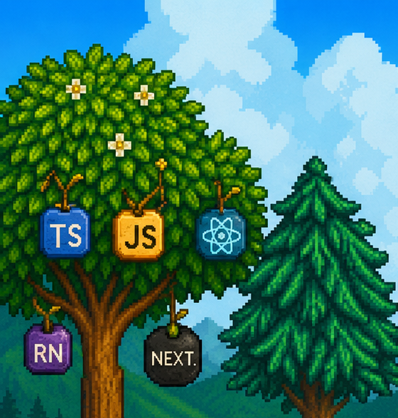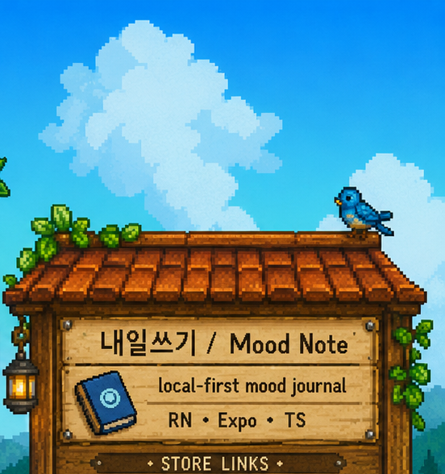 
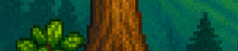<a href="mailto:kyo3553@gmail.com">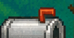</a><a href="https://apps.apple.com/kr/app/%EB%82%B4%EC%9D%BC%EC%93%B0%EA%B8%B0/id6759555409">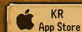</a><a href="https://play.google.com/store/apps/details?id=com.monmon.moodnote&hl=ko&gl=KR">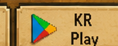</a>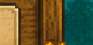 
 
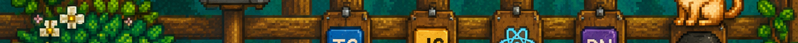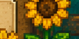 
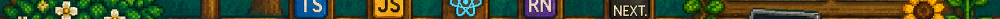 
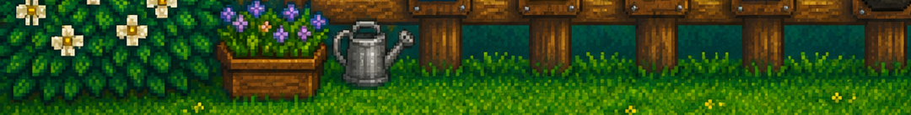<a href="https://www.linkedin.com/in/hansung-kwon-194aa0220/">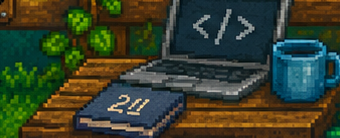</a>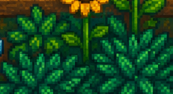 

<!--
Clickable areas:
- IVORY CODE logo: Resume
- Mailbox: Email
- Laptop desk: LinkedIn
- Store Links board: KR/EN App Store and Google Play
-->
