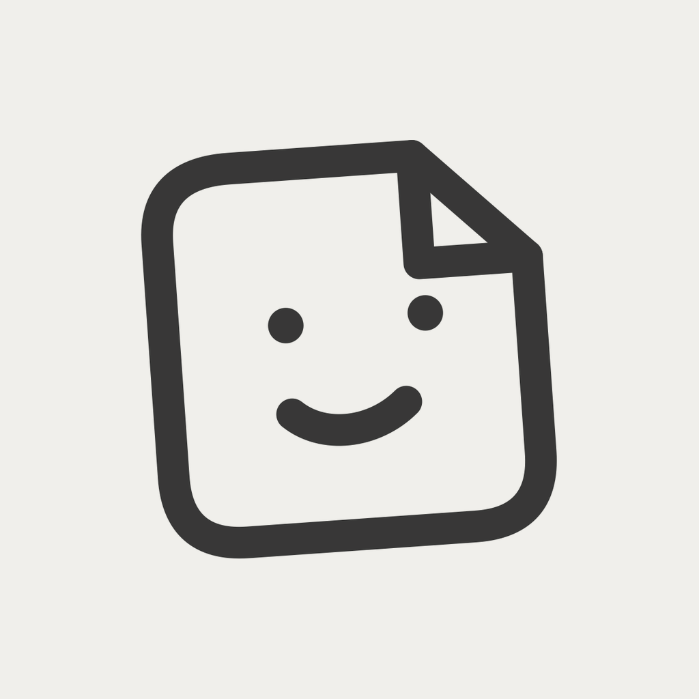
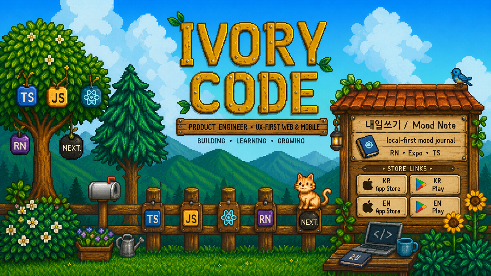

# Hansung Kwon 

**Product Engineer · Web & Mobile**

I build web and mobile products with attention to everyday details.

  &nbsp;TypeScript &nbsp;
  &nbsp;React &nbsp;
  &nbsp;React&nbsp;Native &nbsp;
  &nbsp;Expo &nbsp;
  &nbsp;Next.js

## Selected work

###  QAMap

A local CLI that turns PR commits and diffs into a focused plan for what to verify before merging.

[GitHub](https://github.com/IvoryCanvas/qamap)

###  Mood Note / 내일쓰기

A private journal for iOS and Android. Record a feeling, add words or a drawing, and reflect on your week.

  App Store &nbsp; <a href="https://apps.apple.com/kr/app/%EB%82%B4%EC%9D%BC%EC%93%B0%EA%B8%B0/id6759555409">KO</a> · <a href="https://apps.apple.com/us/app/mood-note-emotion-journal/id6759555409">EN</a> 
  Google Play &nbsp; <a href="https://play.google.com/store/apps/details?id=com.monmon.moodnote&amp;hl=ko&amp;gl=KR">KO</a> · <a href="https://play.google.com/store/apps/details?id=com.monmon.moodnote&amp;hl=en&amp;gl=US">EN</a>

---

[Resume](https://ivory-code.github.io/resume/) · [LinkedIn](https://www.linkedin.com/in/hansung-kwon-194aa0220/) · [Email](mailto:kyo3553@gmail.com)

<!-- Previous profile image — retained for reuse.

-->
